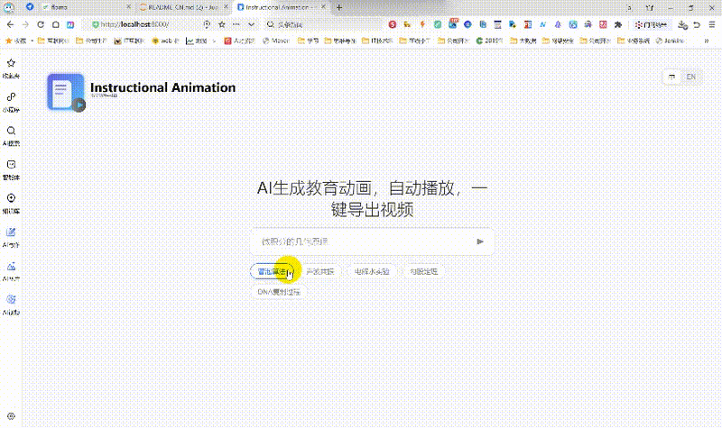

# Instructional Animation - AI 教育动画生成器

> 基于 AI 的智能教育动画生成器，自动创建精美交互式 HTML5 动画并支持导出 MP4 和 GIF 格式


[中文](./README_CN.md) | English

---

## 项目介绍

Instructional Animation 是一个专业的 AI 驱动教育动画生成器，基于大语言模型自动创建视觉精美且交互性强的 HTML5 动画，支持导出为 MP4 视频和 GIF 格式。适用于教育、知识分享、演示文稿制作和在线课程等场景。

### 核心特性

- **AI 驱动**: 使用大语言模型自动生成教育动画
- **精美视觉效果**: 2K 分辨率（1280×720）、浅色主题、专业视觉特效
- **双语支持**: 中文/英文界面和字幕
- **一键导出**: 导出为 HTML、MP4 视频或 GIF 格式
- **流式生成**: 实时 SSE 流式输出
- **多轮对话**: 通过对话迭代优化
- **容器化部署**: Docker 和 Docker Compose 支持
- **多模型支持**: 支持 Anthropic Claude、OpenAI 兼容 LLM、DeepSeek 等
- **连接测试**: 内置 API 连接验证，带视觉反馈
- **动态配置**: 通过设置模态框实时配置 API

---

## 功能清单

| 功能名称 | 功能说明 | 技术栈 | 状态 |
|---------|---------|--------|------|
| AI 动画生成 | 基于大语言模型自动生成动画 | OpenAI API | ✅ 稳定 |
| HTML5 动画 | 交互式 HTML5 动画渲染 | GSAP + HTML5 | ✅ 稳定 |
| MP4 导出 | 导出高清 MP4 视频 | FFmpeg + Playwright | ✅ 稳定 |
| GIF 导出 | 导出动画 GIF | FFmpeg + Playwright | ✅ 稳定 |
| SSE 流式输出 | 实时流式响应 | FastAPI SSE | ✅ 稳定 |
| 多轮对话 | 迭代优化动画 | 对话管理 | ✅ 稳定 |
| Web 配置 | 设置模态框配置 API | JavaScript | ✅ 稳定 |
| 连接测试 | API 连接验证 | HTTP 请求 | ✅ 稳定 |
| Docker 部署 | 容器化一键部署 | Docker + Compose | ✅ 稳定 |
| 双语支持 | 中英文界面 | i18n | ✅ 稳定 |

---

## 技术架构

| 技术 | 版本 | 用途 |
|------|------|------|
| Python | 3.11+ | 主要开发语言 |
| FastAPI | 0.104+ | Web 框架 |
| Playwright | latest | 浏览器自动化和录制 |
| FFmpeg | latest | 视频转码 |
| GSAP | latest | 高性能动画库 |
| Jinja2 | latest | 模板引擎 |

### 系统架构

```
┌─────────────────────────────────────────────────────────────────────────────────┐
│                            系统架构图                                            │
├─────────────────────────────────────────────────────────────────────────────────┤
│                                                                                 │
│   ┌──────────────────┐       ┌─────────────────────────┐       ┌─────────────┐ │
│   │   Web Browser    │ ◄────► │   FastAPI Backend      │ ◄────► │  LLM API    │ │
│   │   端口 8000       │       │   端口 8000             │       │  (AI 引擎)   │ │
│   └──────────────────┘       └─────────────────────────┘       └─────────────┘ │
│           │                            │                              │        │
│           ▼                            ▼                              ▼        │
│   Web 可视化界面            API 接口 + SSE 流式输出          智能动画生成     │
│   设置 + 预览 + 导出          动画生成 + 录制              HTML5 动画       │
│                                                                                 │
└─────────────────────────────────────────────────────────────────────────────────┘
```

---

## 在线演示

无需部署，直接访问体验：

| 访问方式 | 地址 |
|---------|------|
| 🌐 在线演示 | http://115.190.165.156:8000/ |

### 视频演示

<video src="https://github.com/wwwzhouhui/in_animation/raw/main/examples/演示.mp4" controls="controls" width="100%" style="max-width: 800px;">
  Your browser does not support the video tag.
</video>

**GIF 预览**:



---

## 安装说明

### 环境要求

- Python 3.11+
- FFmpeg（用于视频导出）
- Chromium（Playwright 浏览器引擎）
- 操作系统：Linux / macOS / Windows (WSL2)

### 安装依赖

```bash
pip install -r requirements.txt
playwright install chromium
playwright install-deps chromium
```

### 安装 FFmpeg

```bash
# Ubuntu/Debian
sudo apt install ffmpeg

# macOS
brew install ffmpeg

# Windows
# 下载 FFmpeg 并添加到 PATH
```

---

## 使用说明

### 方式一：Docker 部署（推荐）

#### 1. 配置 API Key

复制示例配置文件：

```bash
cp .env.example .env
```

编辑 `.env` 并填入实际值：

```env
API_KEY=your-api-key-here
BASE_URL=https://api.example.com/v1
MODEL=your-model-name
```

#### 2. 启动服务

```bash
docker-compose up -d
```

#### 3. 访问应用

打开浏览器：`http://localhost:8000`

### 方式二：从 Docker Hub 部署

官方镜像：`hub.docker.com/r/wwwzhouhui569/in_animation`

#### 1. 拉取镜像

```bash
docker pull wwwzhouhui569/in_animation:latest
```

#### 2. 准备配置文件

在当前目录创建 `.env` 文件：

```env
API_KEY=your-api-key
BASE_URL=https://api.example.com/v1
MODEL=your-model-name
```

#### 3. 运行容器

```bash
docker run -d \
  --name in_animation \
  -p 8000:8000 \
  -v $(pwd)/.env:/app/.env:ro \
  -v $(pwd)/output:/app/output \
  -v $(pwd)/logs:/app/logs \
  -e TZ=Asia/Shanghai \
  --restart unless-stopped \
  wwwzhouhui569/in_animation:latest
```

#### 4. 访问应用

打开浏览器：`http://localhost:8000`

### 方式三：本地部署

#### 1. 克隆仓库

```bash
git clone https://github.com/wwwzhouhui/in_animation.git
cd in_animation
```

#### 2. 创建虚拟环境

```bash
python -m venv venv
source venv/bin/activate  # Linux/Mac
# 或
venv\Scripts\activate     # Windows
```

#### 3. 安装依赖

```bash
pip install -r requirements.txt
playwright install chromium
playwright install-deps chromium
```

#### 4. 配置 API Key

```bash
cp .env.example .env
```

编辑 `.env` 或使用 Web 界面设置模态框（⚙️）配置

#### 5. 启动服务

```bash
python app.py
# 或
uvicorn app:app --host 0.0.0.0 --port 8000 --reload
```

#### 6. 访问应用

打开浏览器：`http://localhost:8000`

---

## 配置说明

### 环境变量配置

| 变量名 | 说明 | 默认值 |
|--------|------|--------|
| `API_KEY` | LLM API 密钥 | 无（必填） |
| `BASE_URL` | API 服务地址 | 无 |
| `MODEL` | 模型名称 | `ZhipuAI/GLM-4.6` |
| `HOST` | 服务器地址 | `0.0.0.0` |
| `PORT` | 服务器端口 | `8000` |
| `TZ` | 时区 | `Asia/Shanghai` |

### 支持的模型

- ZhipuAI/GLM-4.6
- minimax-m2
- deepseek-ai/DeepSeek-V3.2-Exp
- claude-haiku-4-5-20251001
- Qwen/Qwen3-Coder-480B-A35B-Instruct

### 配置优先级

1. `-e` 环境变量（最高优先级）
2. `.env` 文件
3. `credentials.json`（已弃用，向后兼容）

---

## 使用指南

### 1. 生成动画

1. 输入教育主题（如："勾股定理"、"光的折射"）
2. 点击发送或按 Enter 键
3. 等待 AI 生成动画（10-60 秒）
4. 预览生成的动画

### 2. 迭代优化

在聊天框中输入修改请求，例如：
- "添加更多示例"
- "减慢动画速度"
- "添加证明过程说明"

### 3. 导出动画

- **新窗口打开**: 在独立窗口中预览
- **保存为 HTML**: 下载完整 HTML 文件
- **导出视频**: 生成 MP4 视频（需要 FFmpeg）
- **导出 GIF**: 生成动画 GIF（需要 FFmpeg）

### 4. 设置与配置

点击左上角设置按钮（⚙️）打开设置模态框：

**配置选项**：
- **API Key**: 输入 LLM API 密钥（必需）
- **Base URL**: API 服务地址（可选，留空使用默认）
- **Model Name**: 从下拉列表选择模型（必需）

**测试连接**：
- 点击"测试连接"按钮验证 API 配置
- 系统显示视觉反馈（成功✓或失败✗图标）
- 成功显示："测试成功！模型'xxx'可访问"
- 失败显示具体错误消息（无效 API 密钥、模型未找到等）

**保存设置**：
- 验证后点击"保存设置"
- 配置自动保存到 `.env` 文件
- 立即生效，无需重启服务器

---

## API 接口

### POST /generate

生成教育动画（SSE 流式响应）

**请求体**：
```json
{
  "topic": "教育主题",
  "history": [
    {"role": "user", "content": "..."},
    {"role": "assistant", "content": "..."}
  ]
}
```

### POST /record

录制页面并导出视频

**请求体**：
```json
{
  "html_text": "<html>...</html>",
  "width": 1280,
  "height": 720,
  "fps": 24,
  "mp4": true,
  "gif": true,
  "end_event": "recording:finished",
  "end_timeout": 180000,
  "gif_fps": 10,
  "gif_width": 720,
  "gif_dither": "sierra2_4a"
}
```

### POST /config

获取或更新 API 配置

**获取配置（GET）**：
```bash
curl http://localhost:8000/config
```

**更新配置（POST）**：
```bash
curl -X POST http://localhost:8000/config \
  -H "Content-Type: application/json" \
  -d '{
    "api_key": "your-api-key",
    "base_url": "https://api.example.com/v1",
    "model": "your-model"
  }'
```

### POST /test-config

测试 API 连接

**请求体**：
```json
{
  "api_key": "your-api-key",
  "base_url": "https://api.example.com/v1",
  "model": "your-model"
}
```

**响应（成功）**：
```json
{
  "ok": true,
  "message": "测试成功！模型'your-model'可访问",
  "model": "your-model"
}
```

**响应（失败）**：
```json
{
  "ok": false,
  "error": "测试失败：无效的 API 密钥"
}
```

---

## 项目结构

```
in_animation/
├── app.py                   # FastAPI 主应用
├── requirements.txt         # Python 依赖
├── .env.example            # 环境变量示例
├── Dockerfile              # Docker 镜像配置
├── docker-compose.yml      # Docker Compose 配置
├── README.md               # 项目文档（英文）
├── README_CN.md           # 项目文档（中文）
├── examples/               # 示例文件
│   ├── 演示.mp4
│   └── demo.gif
├── .generated_html/        # 生成的 HTML 文件
└── .recordings/            # 录制的视频
```

---

## 开发指南

### 本地开发

```bash
# 克隆仓库
git clone https://github.com/wwwzhouhui/in_animation.git
cd in_animation

# 创建虚拟环境
python -m venv venv
source venv/bin/activate

# 安装依赖
pip install -r requirements.txt
playwright install chromium

# 配置 API Key
cp .env.example .env

# 启动服务
python app.py
```

### Docker 开发

```bash
# 构建镜像
docker build -t in_animation .

# 运行容器
docker run -d -p 8000:8000 --name in_animation in_animation

# 查看日志
docker logs -f in_animation
```

---

## 常见问题

<details>
<summary>Q: API 密钥错误？</summary>

A:
1. 检查 `.env` 文件是否存在且包含有效的 API 密钥
2. 或使用左上角设置按钮（⚙️）通过 Web 界面配置
3. 点击"测试连接"在保存前验证 API 密钥
</details>

<details>
<summary>Q: FFmpeg 未找到？</summary>

A:
1. 安装 FFmpeg 或设置 `FFMPEG_PATH` 环境变量
2. Ubuntu/Debian: `sudo apt install ffmpeg`
3. macOS: `brew install ffmpeg`
4. Windows: 下载 FFmpeg 并添加到 PATH
</details>

<details>
<summary>Q: Playwright 浏览器未安装？</summary>

A:
1. 运行 `playwright install chromium`
2. 运行 `playwright install-deps chromium`
3. Docker 部署时浏览器已预装
</details>

<details>
<summary>Q: 模型不支持？</summary>

A: 检查设置模态框中的支持模型列表：
- ZhipuAI/GLM-4.6
- minimax-m2
- deepseek-ai/DeepSeek-V3.2-Exp
- claude-haiku-4-5-20251001
- Qwen/Qwen3-Coder-480B-A35B-Instruct
</details>

<details>
<summary>Q: 配置不生效？</summary>

A:
1. 配置更改保存到 `.env` 文件并立即生效
2. 无需重启服务器
3. 使用设置模态框在运行时更新配置
</details>

<details>
<summary>Q: 视频导出失败？</summary>

A:
1. 确认 FFmpeg 已正确安装
2. 检查 `FFMPEG_PATH` 环境变量
3. 查看浏览器控制台错误信息
4. Docker 部署时 FFmpeg 已预装
</details>

<details>
<summary>Q: 动画生成速度慢？</summary>

A:
1. 取决于 LLM API 响应速度
2. 尝试使用更快的模型
3. 检查网络连接
4. 减少动画复杂度
</details>

<details>
<summary>Q: Docker 容器无法启动？</summary>

A:
1. 检查端口 8000 是否被占用
2. 确认 `.env` 文件存在
3. 查看 Docker 日志：`docker logs in_animation`
4. 确认 Docker 守护进程正在运行
</details>

<details>
<summary>Q: 如何更改端口？</summary>

A:
1. 修改 `.env` 文件中的 `PORT` 变量
2. 或使用环境变量：`docker run -p 8888:8000`
3. Docker Compose: 修改 `docker-compose.yml` 中的端口映射
</details>

<details>
<summary>Q: 连接测试失败？</summary>

A:
1. 检查 API 密钥是否正确
2. 确认 Base URL 是否可访问
3. 验证模型名称是否正确
4. 检查网络连接和防火墙设置
</details>

---

## 技术交流群

欢迎加入技术交流群，分享你的使用心得和反馈建议：


---

## 作者联系

- **微信**: laohaibao2025
- **邮箱**: 75271002@qq.com


---

## 打赏

如果这个项目对你有帮助，欢迎请我喝杯咖啡 ☕

**微信支付**


---

## Star History

如果觉得项目不错，欢迎点个 Star ⭐

[](https://star-history.com/#wwwzhouhui/in_animation&Date)

---

## License

MIT License

---

## 更新日志

### v2.1.0 (2025-10-30)

**新功能**：
- ✨ 新增设置模态框，支持 Web 界面配置 API
- ✨ 新增连接测试功能，实时验证 API
- ✨ 新增多模型支持：minimax-m2、DeepSeek-V3.2-Exp、Claude Haiku、Qwen3-Coder
- ✨ 新增 GIF 导出功能
- 🎨 增强视觉反馈：连接测试显示 ✓/✗ 图标和动画
- 📦 新增 `.env` 文件支持，热重载无需重启服务器
- 📄 新增 `.env.example` 配置模板文件

**改进**：
- 🔄 增强录制功能，更多参数（gif_fps、gif_width、gif_dither）
- 🎯 更好的错误处理和用户反馈
- 📱 优化前端用户体验

**配置变更**：
- 🆕 优先使用 `.env` 文件而非 `credentials.json`
- 🔄 配置优先级：环境变量 > `.env` > `credentials.json`（向后兼容）
- ✅ 推荐使用 `.env` 或 Web 界面设置，两者都支持热重载

**API 变更**：
- 新增 `/config` 端点：获取和更新配置
- 新增 `/test-config` 端点：测试 API 连接
- 增强 `/record` 端点：支持 GIF 导出参数

### v2.0.0

- 🤖 首次发布
- 🎬 AI 驱动的教育动画生成
- 📹 MP4 视频导出支持
- 🌍 双语支持

---

## 致谢

- [fogsight](https://github.com/fogsightai/fogsight) - fogsight 是一个由大语言模型（LLM）驱动的动画引擎代理
- [FastAPI](https://fastapi.tiangolo.com/)
- [Playwright](https://playwright.dev/)
- [FFmpeg](https://ffmpeg.org/)
- [GSAP](https://greensock.com/gsap/)

---

## 贡献指南

欢迎贡献！请：

1. Fork 本仓库
2. 创建特性分支：`git checkout -b feature/amazing-feature`
3. 提交更改：`git commit -m 'Add amazing feature'`
4. 推送到分支：`git push origin feature/amazing-feature`
5. 提交 Pull Request

---

**Enjoy creating educational animations with AI! 🎬✨**
